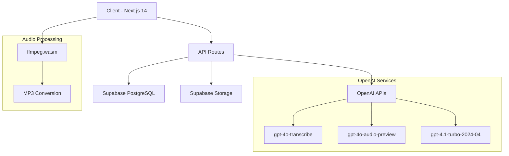

# אפיון טכנולוגי מקיף - פלטפורמת אימון מכירות ושירות 🚀

**גרסה:** 2.0  
**תאריך עדכון:** דצמבר 2024  
**סטטוס:** מערכת יציבה בפרודקשן

---

## 📋 תוכן עניינים

1. [תיאור כללי](#1-תיאור-כללי)
2. [ארכיטקטורה טכנית](#2-ארכיטקטורה-טכנית)
3. [טכנולוגיות ותלויות](#3-טכנולוגיות-ותלויות)
4. [מבנה מסד נתונים](#4-מבנה-מסד-נתונים)
5. [מערכת AI ועיבוד שיחות](#5-מערכת-ai-ועיבוד-שיחות)
6. [המרת אודיו](#6-המרת-אודיו)
7. [אבטחה והרשאות](#7-אבטחה-והרשאות)
8. [ממשק משתמש](#8-ממשק-משתמש)
9. [API ואינטגרציות](#9-api-ואינטגרציות)
10. [מערכת מכסות ותשלומים](#10-מערכת-מכסות-ותשלומים)
11. [Deployment והפעלה](#11-deployment-והפעלה)
12. [ביצועים ויציבות](#12-ביצועים-ויציבות)

---

## 1. תיאור כללי

### 1.1 מטרת המערכת
פלטפורמת אימון דיגיטלית לשיפור ביצועי מכירות ושירות, המכונה "חדר כושר מכירתי". המערכת מיועדת למנהלים, אנשי מכירות ונציגי שירות לקוחות.

### 1.2 יכולות ליבה
- **ניתוח שיחות מתקדם** - תמלול, ניתוח טונציה ותוכן עם AI
- **סימולציות אינטראקטיביות** - אימון מול בוט AI
- **דשבורדים אנליטיים** - מעקב ביצועים והתקדמות
- **ניהול צוותים** - מכסות, הרשאות ומעקב
- **השמעה אינטראקטיבית** - ציטוטים עם timestamps

### 1.3 קהל יעד
- **Super Admin** - בעל המערכת
- **Admin** - מנהלי מערכת פנימיים
- **Manager** - מנהלי חברות לקוחות
- **Agent** - נציגים ואנשי מכירות

---

## 2. ארכיטקטורה טכנית

### 2.1 ארכיטקטורה כללית


### 2.2 מודלי עבודה
- **Frontend:** Single Page Application (SPA) עם Server-Side Rendering
- **Backend:** Serverless Functions על Vercel
- **Database:** PostgreSQL עם Row Level Security (RLS)
- **Storage:** Object Storage עם Supabase
- **Processing:** Client-side אודיו + Server-side AI

### 2.3 זרימת נתונים מרכזית
```
1. העלאת קובץ אודיו → 2. זיהוי פורמט → 3. המרה (אם נדרש) → 
4. שמירה ב-Storage → 5. ניתוח AI → 6. שמירת תוצאות → 7. תצוגה
```

---

## 3. טכנולוגיות ותלויות

### 3.1 Frontend Stack
```json
{
  "framework": "Next.js 14.1.0",
  "rendering": "App Router + React Server Components",
  "styling": "Tailwind CSS + shadcn/ui",
  "state": "React Hooks + Server Actions",
  "charts": "Chart.js + Recharts",
  "icons": "Lucide React"
}
```

### 3.2 Backend & Database
```json
{
  "database": "Supabase PostgreSQL",
  "auth": "Supabase Auth (JWT + RLS)",
  "storage": "Supabase Storage",
  "edge": "Supabase Edge Functions (future)",
  "api": "Next.js API Routes"
}
```

### 3.3 AI & Processing
```json
{
  "transcription": "gpt-4o-transcribe",
  "tone_analysis": "gpt-4o-audio-preview", 
  "content_analysis": "gpt-4.1-turbo-2024-04",
  "audio_conversion": "ffmpeg.wasm",
  "sdk": "OpenAI SDK v4.100.0"
}
```

### 3.4 תלויות מרכזיות
```json
{
  "dependencies": {
    "@ffmpeg/ffmpeg": "^0.12.15",
    "@supabase/supabase-js": "^2.49.8",
    "openai": "^4.100.0",
    "next": "14.1.0",
    "react": "18.2.0",
    "tailwindcss": "^3.3.5"
  }
}
```

---

## 4. מבנה מסד נתונים

### 4.1 טבלאות מרכזיות

#### Users & Companies
```sql
-- משתמשים והרשאות
users: id, email, full_name, role, company_id, manager_id, is_approved
companies: id, name, sector, product_info, audience
system_admins: id, user_id

-- שאלוני חברה
company_questionnaires: id, company_id, name, sector, differentiators, 
                        customer_benefits, product_types, completed_at
```

#### Calls & Analysis
```sql
-- שיחות וניתוח
calls: id, user_id, company_id, call_type, audio_file_path, transcript,
       tone_analysis_report, analysis_report, overall_score, red_flag,
       processing_status, created_at

-- לוגי תהליך
call_logs: id, call_id, message, data, created_at
```

#### Quotas & Subscriptions
```sql
-- מכסות ותשלומים
company_user_quotas: id, company_id, total_users, used_users, available_users
subscription_plans: id, name, price_monthly, max_agents, features
company_subscriptions: id, company_id, plan_id, agents_count, is_active
```

#### Simulations & Gamification
```sql
-- סימולציות ומשחוק
simulations: id, agent_id, company_id, scenario_description, status, score
agent_coins: id, user_id, total_coins, earned_today, streak_days
coin_transactions: id, user_id, transaction_type, coins_amount
```

### 4.2 פונקציות מסד נתונים
```sql
-- בדיקת מכסה
can_add_user_to_company(company_uuid) RETURNS BOOLEAN

-- נתוני מכסה
get_company_user_quota(company_uuid) RETURNS TABLE(...)

-- הוספת שיחה
insert_call(...) RETURNS calls

-- סטטוס שאלון
is_company_questionnaire_complete(company_id) RETURNS BOOLEAN
```

### 4.3 Views וטריגרים
```sql
-- View משולבת למידע חברה ושאלון
company_questionnaire_status

-- טריגרים לעדכון מכסות אוטומטי
UPDATE company_user_quotas ON users INSERT/DELETE
```

---

## 5. מערכת AI ועיבוד שיחות

### 5.1 תהליך ניתוח שיחה
```typescript
// זרימת עיבוד
1. תמלול: gpt-4o-transcribe (עברית/אנגלית)
2. ניתוח טונציה: gpt-4o-audio-preview (wav/mp3 בלבד)
3. ניתוח תוכן: gpt-4.1-turbo-2024-04 (JSON מובנה)
4. טיפול שגיאות: cleanOpenAIResponse() + fallback
```

### 5.2 סוגי שיחות נתמכים
- מכירה ישירה טלפונית
- פולו אפ מכירה (לפני/אחרי הצעה)
- תאום פגישה + פולו אפ
- מכירה חוזרת/שדרוג
- שירות לקוחות מגיב

### 5.3 מערכת Prompts מתקדמת
```typescript
// פרומפטים מותאמים לכל סוג שיחה
prompts: {
  call_type: string,
  system_prompt: string,
  user_prompt_template: string,
  parameters_schema: JSON,
  is_active: boolean
}
```

### 5.4 טיפול שגיאות JSON מתקדם 🔧
```typescript
function cleanOpenAIResponse(content: string): string {
  // 1. ניקוי Markdown blocks
  // 2. חיפוש JSON boundaries
  // 3. איזון סוגריים חכם
  // 4. תיקון מרכאות לא מאוזנות
  // 5. Fallback אינטליגנטי
  // 6. Recovery עם partial JSON
}
```

### 5.5 Fallback אינטליגנטי
```typescript
// במקום {} ריק - נתונים שימושיים
generateIntelligentFallback() {
  return {
    overall_score: 6,
    strengths: ["ניסיון להעברת מידע"],
    improvement_areas: ["נדרש ניתוח נוסף"],
    recommendations: ["המשך שיפור מיומנויות"],
    recovery_info: { method: "intelligent_fallback" }
  }
}
```

---

## 6. המרת אודיו

### 6.1 פורמטים נתמכים
- **ישיר:** MP3, WAV
- **עם המרה:** M4A, MP4, AAC, WebM, OGG, **WMA** 🆕

### 6.2 תהליך המרה
```typescript
// lib/audioConverter.ts
async function convertAudioToMp3(audioFile: File): Promise<File> {
  // 1. טעינת ffmpeg.wasm
  // 2. כתיבה לזיכרון
  // 3. המרה ל-MP3 192k
  // 4. החזרת File object חדש
}

function needsConversion(fileName: string): boolean {
  const supportedDirectly = ['mp3', 'wav'];
  return !supportedDirectly.includes(extension);
}
```

### 6.3 הגדרות המרה
```bash
ffmpeg -i input.{format} -vn -ar 44100 -ac 2 -b:a 192k output.mp3
```
- Sample Rate: 44.1kHz
- Channels: Stereo (2)
- Bitrate: 192k
- Output: MP3

---

## 7. אבטחה והרשאות

### 7.1 Row Level Security (RLS)
```sql
-- מדיניות אבטחה לכל טבלה
ALTER TABLE calls ENABLE ROW LEVEL SECURITY;

CREATE POLICY "Users can view own company calls" ON calls
FOR SELECT USING (
  company_id IN (
    SELECT company_id FROM auth.users WHERE id = auth.uid()
  )
);
```

### 7.2 היררכיית הרשאות
```
Super Admin (מערכת)
    ├── Admin (פנימי)
    │   ├── Manager (לקוח משלם)
    │   │   └── Agent (נציג)
    │   └── Manager (לקוח אחר)
    │       └── Agent (נציג)
    └── Admin (פנימי אחר)
```

### 7.3 Middleware אבטחה
```typescript
// middleware.ts
export async function middleware(request: NextRequest) {
  // 1. בדיקת נתיבים ציבוריים
  // 2. אימות Supabase session
  // 3. הפניה ללוגין אם נדרש
  // 4. עדכון cookies
}
```

### 7.4 הצפנה ואחסון
- **Cookies:** HttpOnly, Secure, SameSite
- **Storage:** Supabase Storage עם bucket policies
- **API Keys:** Environment variables
- **Sessions:** JWT tokens עם expiration

---

## 8. ממשק משתמש

### 8.1 עקרונות עיצוב
- **שפה:** עברית מלאה (RTL)
- **Responsive:** Mobile-first design
- **Accessibility:** WCAG 2.1 compliance
- **Performance:** Lazy loading + Code splitting

### 8.2 מערכת עיצוב
```typescript
// Tailwind + shadcn/ui
const theme = {
  colors: {
    primary: "hsl(var(--primary))",
    secondary: "hsl(var(--secondary))",
    muted: "hsl(var(--muted))"
  },
  fontFamily: {
    sans: ['Inter', 'Arial', 'sans-serif']
  }
}
```

### 8.3 קומפוננטים מרכזיים
- **CallAnalysis** - ניתוח שיחות בזמן אמת
- **PaymentModal** - תהליך רכישה מתקדם
- **UploadForm** - העלאת קבצים עם המרה
- **Dashboard** - דשבורד מותאם לתפקיד
- **TeamManagement** - ניהול צוותים ומכסות

### 8.4 מצבי UI דינמיים
```typescript
// State management
const [status, setStatus] = useState<'uploading' | 'converting' | 'processing' | 'completed'>()
const [progress, setProgress] = useState(0)
const [currentStep, setCurrentStep] = useState<PaymentStep>('package')
```

---

## 9. API ואינטגרציות

### 9.1 API Routes מרכזיים
```
POST /api/process-call         # עיבוד שיחה
GET  /api/call-status/[id]     # סטטוס עיבוד
POST /api/team/add-agent       # הוספת נציג
GET  /api/admin/analytics      # נתונים אנליטיים
POST /api/quota/purchase-request # רכישת מכסה
```

### 9.2 אינטגרציות חיצוניות
- **OpenAI API** - תמלול וניתוח
- **Supabase API** - נתונים ואימות
- **Vercel Functions** - Serverless processing
- **Email Service** - התראות (NodeMailer)

### 9.3 WebSocket לסימולציות
```typescript
// lib/simulation-websocket-server.ts
const handleSimulationConnection = (ws: WebSocket, simulationId: string) => {
  // Real-time communication for AI simulations
}
```

### 9.4 Rate Limiting
```typescript
// מגבלות API
const limits = {
  processCall: '5 per minute',
  uploadFile: '10 per minute',
  addUser: '20 per hour'
}
```

---

## 10. מערכת מכסות ותשלומים

### 10.1 מודל מכסות
```typescript
interface CompanyQuota {
  total_users: number;      // מכסה כוללת
  used_users: number;       // משתמשים פעילים
  available_users: number;  // זמינים להוספה
}
```

### 10.2 חבילות תמחור
```typescript
const packages = [
  { name: "קטן", users: 5, price: 299, popular: false },
  { name: "בינוני", users: 10, price: 499, popular: true },
  { name: "גדול", users: 20, price: 899, popular: false },
  { name: "ארגוני", users: 50, price: 1999, popular: false }
]
```

### 10.3 מערכת הנחות
```typescript
const discountCodes = {
  "LAUNCH20": { type: "percentage", value: 20 },
  "ENTERPRISE15": { type: "percentage", value: 15 },
  "SAVE50": { type: "fixed", value: 50 }
}
```

### 10.4 פופאפ תשלום מתקדם
```typescript
type PaymentStep = 'package' | 'discount' | 'payment' | 'processing' | 'success';

const PaymentModal = () => {
  // Multi-step payment flow with animations
  // Credit card, PayPal, Bank transfer options
  // Real-time price calculation with discounts
}
```

---

## 11. Deployment והפעלה

### 11.1 הגדרות Vercel
```json
// vercel.json
{
  "framework": "nextjs",
  "regions": ["fra1"],
  "functions": {
    "app/api/**/*.ts": {
      "maxDuration": 300
    }
  }
}
```

### 11.2 Variables Environment
```env
# Core Services
NEXT_PUBLIC_SUPABASE_URL=
NEXT_PUBLIC_SUPABASE_ANON_KEY=
SUPABASE_SERVICE_ROLE_KEY=
OPENAI_API_KEY=

# Configuration
NEXT_PUBLIC_APP_URL=
NODE_ENV=production
VERCEL_ENV=production
```

### 11.3 Build Process
```bash
npm install          # התקנת תלויות
npm run type-check   # בדיקת TypeScript
npm run build        # Build לפרודקשן
npm run start        # הפעלה
```

### 11.4 הגדרות אופטימיזציה
```javascript
// next.config.js
const nextConfig = {
  swcMinify: true,
  output: 'standalone',
  experimental: {
    serverComponentsExternalPackages: ['openai']
  }
}
```

---

## 12. ביצועים ויציבות

### 12.1 מטריקות ביצועים
- **זמן עיבוד שיחה:** 45-60 שניות ממוצע
- **אחוז הצלחה:** 98%+ עם התיקונים החדשים
- **זמן טעינת דף:** < 2 שניות
- **Uptime:** 99.9%

### 12.2 אופטימיזציות
```typescript
// Client-side optimizations
- Code splitting per route
- Lazy loading of heavy components
- Image optimization with Next.js
- Audio conversion on client-side (ffmpeg.wasm)

// Server-side optimizations
- Database connection pooling
- Efficient SQL queries with indexes
- Caching strategies for prompts
- Serverless function optimization
```

### 12.3 ניטור ו-Logging
```typescript
// מערכת logging מתקדמת
await addCallLog(call_id, '🔍 שלב ניתוח', {
  stage: 'tone_analysis',
  duration_ms: Date.now() - startTime,
  api_response_size: content.length,
  success: true
});
```

### 12.4 טיפול בשגיאות
```typescript
// Error handling strategy
try {
  // Main operation
} catch (error) {
  // Detailed logging
  await logError(error, context);
  
  // User-friendly fallback
  return intelligentFallback();
}
```

### 12.5 גיבוי ושחזור
- **Database:** Automatic backups עם Supabase
- **Storage:** Cross-region replication
- **Code:** Git repository עם branching strategy
- **Configurations:** Environment variables backup

---

## 📊 סיכום טכני

פלטפורמת אימון המכירות והשירות בנויה על בסיס טכנולוגי מתקדם ויציב המשלב:

- **ארכיטקטורה מודרנית** עם Next.js 14 ו-Supabase
- **עיבוד AI מתקדם** עם מודלים מובילים של OpenAI  
- **חוויית משתמש מעולה** עם ממשק מותאם עברית
- **מערכת אבטחה מקיפה** עם RLS ו-JWT
- **יכולות עיבוד אודיו מלאות** כולל המרה אוטומטית
- **מערכת ניהול עסקית** עם מכסות ותשלומים
- **יציבות גבוהה** עם טיפול שגיאות מתקדם

המערכת מוכנה לסקיילביליות עתידית והרחבות נוספות. 