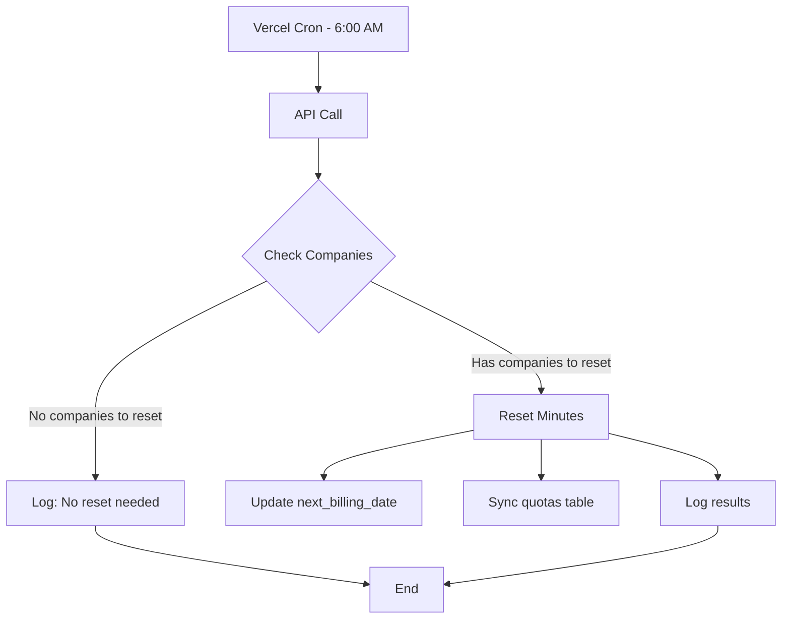

# מערכת חיוב חודשי - איפוס דקות

## סקירה כללית

מערכת חיוב חודשית שמאפסת דקות לחברות לפי תאריך ההצטרפות שלהן. כל חברה מקבלת איפוס בתאריך שבו היא הצטרפה לשירות.

## איך זה עובד

### 1. לוגיקת החיוב
- **המנוי אף פעם לא פג** - החברה נשארת פעילה
- **רק הדקות מתאפסות** כל חודש בתאריך ההצטרפות
- **חישוב תאריך הבא** - לפי יום החודש של תאריך ההצטרפות

### 2. דוגמאות
- **אפקטיבייט**: הצטרפה ב-16/7 → איפוס ב-16 לכל חודש
- **בדיקה**: הצטרפה ב-26/8 → איפוס ב-26 לכל חודש

## רכיבי המערכת

### 📊 פונקציות מסד נתונים

#### `reset_monthly_minutes()`
מאפסת דקות לחברות שהגיע זמן האיפוס שלהן:
```sql
SELECT * FROM reset_monthly_minutes();
```

#### `check_monthly_billing_status()`
בודקת סטטוס חיוב של כל החברות:
```sql
SELECT * FROM check_monthly_billing_status();
```

#### `sync_subscription_quotas()`
מסנכרנת מכסות דקות עם מנויים:
```sql
SELECT * FROM sync_subscription_quotas();
```

### 🌐 API Endpoints

#### POST `/api/billing/reset-monthly-minutes`
מריץ איפוס דקות חודשי:
- **אוטומטי**: Vercel Cron (יומיית ב-6:00)
- **ידני**: עם API key

#### GET `/api/billing/reset-monthly-minutes`
בודק סטטוס חיוב נוכחי:
```json
{
  "totalActiveSubscriptions": 2,
  "subscriptionsNeedingReset": 0,
  "nextResetDue": "אפקטיבייט in 21 days (2025-09-16)",
  "details": [...]
}
```

### ⏰ Vercel Cron Job

מוגדר ב-`vercel.json`:
```json
{
  "crons": [
    {
      "path": "/api/billing/reset-monthly-minutes",
      "schedule": "0 6 * * *"
    }
  ]
}
```

רץ כל יום ב-6:00 בבוקר ובודק אם יש חברות שצריכות איפוס.

## פלואו של האיפוס



## מעקב ובקרה

### לוגים
כל הפעלה נרשמת עם:
- מקור ההפעלה (Vercel Cron / Manual)
- זמן ההפעלה
- מספר חברות שאופסו
- פרטי האיפוס

### בדיקה ידנית
```bash
# בדיקת סטטוס
curl https://your-domain.com/api/billing/reset-monthly-minutes

# איפוס ידני (עם API key)
curl -X POST \
  -H "x-api-key: your-api-key" \
  https://your-domain.com/api/billing/reset-monthly-minutes
```

## הגדרות

### משתני סביבה
```env
MONTHLY_RESET_API_KEY=reset_monthly_minutes_2024_secure_key_ka_analyzer
```

### מבנה מסד נתונים
- `company_subscriptions.starts_at` - תאריך הצטרפות
- `company_subscriptions.next_billing_date` - תאריך איפוס הבא
- `company_subscriptions.current_minutes` - דקות נוכחיות
- `subscription_plans.base_minutes` - דקות מהתוכנית

## רווח והכנסות

המערכת מיועדת לעבוד עם מודל "מנוי לא פג":
- 💰 **תשלום חודשי קבוע** ללא תלות בשימוש
- 📊 **איפוס דקות** מונע הצטברות יתר
- 🔄 **התחדשות אוטומטית** עד לביטול ידני

הלקוח משלם עד שמבטל, כמו Netflix או Spotify.