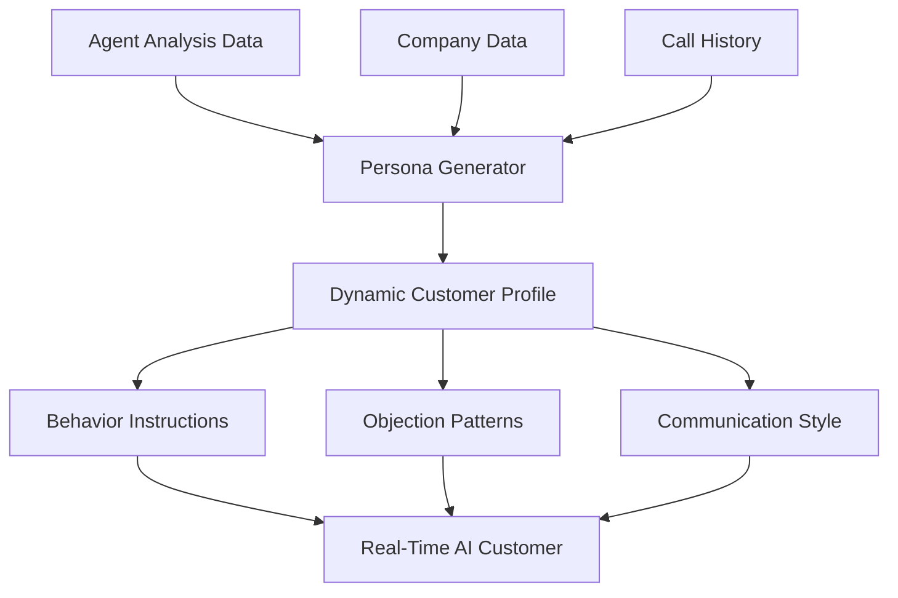
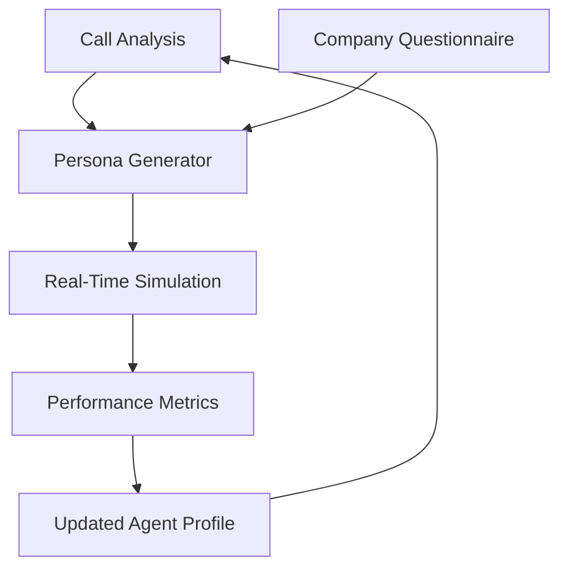

# Real-Time Sales & Service Simulations - Technical Specification
**Date:** August 2025  
**Project:** Sales Training Platform - Real-Time AI Simulations

## 🎯 Executive Summary

This document outlines the specification for building advanced real-time voice simulations that will transform your sales training platform into a true "sales gym" experience. The system will use OpenAI's latest real-time capabilities combined with analysis-driven customer personas to create hyper-realistic training scenarios.

## 🔍 Current System Analysis

### ✅ What Works Well
- **Excellent call analysis foundation** - GPT-4 based analysis with precise timestamped quotes
- **Robust audio processing** - Support for all formats including WMA with automatic conversion
- **Smart error handling** - Advanced JSON parsing with intelligent fallbacks
- **Comprehensive user management** - Dynamic quotas and role-based permissions
- **Strong technical foundation** - Next.js, Supabase, TypeScript with excellent patterns

### 🚧 Current Simulation Limitations
- **Basic implementation** - Simple WebSocket with placeholder responses
- **Static scenarios** - Fixed prompts not adapted to agent analysis
- **No voice integration** - Text-based only, no real-time voice
- **Limited personalization** - Scenarios don't leverage company data or agent weaknesses

## 🚀 Vision: Next-Generation Real-Time Simulations

### Core Concept
Transform static analysis into **dynamic, personalized voice training experiences** where:
- AI customers respond in real-time based on agent's specific weaknesses
- Scenarios adapt dynamically using company questionnaire data
- Voice conversations feel natural and challenging
- Training directly targets improvement areas identified in analysis

## 🏗️ Proposed Architecture

### 1. AI-Driven Customer Persona Engine


**Components:**
- **Analysis Parser**: Extracts weaknesses from agent's call analysis
- **Company Context Engine**: Uses questionnaire data for industry-specific scenarios
- **Persona Builder**: Creates detailed customer profiles targeting specific improvement areas
- **Behavior Generator**: Defines how AI customer should react to different approaches

### 2. Real-Time Voice System Architecture
```typescript
// High-level architecture
interface RealTimeSimulation {
  // Voice Processing
  audioInput: WebRTCStream
  audioOutput: WebRTCStream
  
  // AI Integration
  openaiRealtimeAPI: OpenAIRealtimeConnection
  contextEngine: PersonaContextEngine
  
  // Analysis Integration
  agentProfile: AgentAnalysisData
  companyContext: CompanyQuestionnaireData
  
  // Real-time Features
  liveTranscription: LiveTranscriptStream
  emotionDetection: EmotionAnalysisStream
  performanceTracking: RealTimeMetrics
}
```

### 3. OpenAI Integration Strategy

Based on August 2025 capabilities:

#### Primary Approach: OpenAI Realtime API + Agent Framework
```typescript
// Using latest OpenAI capabilities
const simulationConfig = {
  // New Agent SDK for complex scenarios
  agent: {
    tools: [
      'company_objection_handler',
      'customer_background_generator', 
      'scenario_difficulty_adjuster'
    ],
    responses_api: true, // For structured responses
    real_time_voice: true
  },
  
  // GPT-4o voice mode for natural conversation
  voice_model: 'gpt-4o-realtime',
  language: 'hebrew',
  
  // Dynamic instruction generation
  instructions: generatePersonaInstructions(agentAnalysis, companyData)
}
```

#### Fallback: Enhanced WebSocket + GPT-4o Voice
If Realtime API isn't available, use:
- WebSocket for real-time communication
- GPT-4o voice mode for audio processing
- Streaming responses for natural conversation flow

## 📊 Persona Generation System

### 1. Analysis-Driven Persona Creation

```typescript
interface PersonaGenerator {
  // Input data
  agentWeaknesses: string[]
  companyData: CompanyQuestionnaire
  callHistory: CallAnalysis[]
  
  // Generated persona
  createPersona(): CustomerPersona {
    return {
      // Personality targeting weaknesses
      personality: this.buildTargetedPersonality(),
      
      // Industry-specific context
      background: this.buildIndustryBackground(),
      
      // Objection patterns to practice
      objectionStyle: this.buildObjectionStrategy(),
      
      // Communication preferences
      communicationStyle: this.buildCommunicationStyle(),
      
      // Success criteria
      conversionTriggers: this.buildConversionTriggers()
    }
  }
}
```

### 2. Dynamic Difficulty Adjustment

```typescript
class DifficultyEngine {
  adjustDifficulty(currentPerformance: RealTimeMetrics): void {
    if (currentPerformance.confidence > 0.8) {
      this.increaseObjections()
      this.addTimeConstraints()
    } else if (currentPerformance.confidence < 0.4) {
      this.provideSupportiveResponses()
      this.offerHints()
    }
  }
}
```

## 🎭 Scenario Types Based on Analysis

### 1. Weakness-Targeted Scenarios
- **Opening Struggles** → Cold call practice with resistant customers
- **Objection Handling Issues** → Price-sensitive customers with multiple concerns
- **Closing Problems** → Indecisive customers requiring multiple close attempts
- **Product Knowledge Gaps** → Technical customers asking detailed questions

### 2. Company-Specific Scenarios
Using questionnaire data:
- **B2B vs B2C** → Different conversation styles and decision makers
- **Industry Context** → Relevant terminology and pain points
- **Product Differentiation** → Competitors and unique value propositions
- **Customer Benefits** → Specific value propositions to practice

### 3. Progressive Skill Building
- **Foundation Level** → Basic conversation flow and product knowledge
- **Intermediate** → Handling objections and building rapport
- **Advanced** → Complex sales scenarios and difficult customers
- **Expert** → Multi-stakeholder sales and enterprise scenarios

## 🛠️ Technical Implementation Plan

### Phase 1: Enhanced Persona Engine (2-3 weeks)
```typescript
// New components to build
components/
├── PersonaGenerator.tsx      // UI for persona creation
├── ScenarioBuilder.tsx       // Scenario configuration
├── SimulationStudio.tsx      // Complete simulation environment
└── RealTimeCoach.tsx         // Live coaching during simulation

api/
├── personas/generate/        // AI persona generation
├── scenarios/create/         // Dynamic scenario creation
└── simulations/realtime/     // Real-time simulation engine
```

### Phase 2: Real-Time Voice Integration (3-4 weeks)
```typescript
// Voice processing components
lib/
├── realtime-client.ts        // OpenAI Realtime API client
├── voice-processor.ts        // Audio processing and streaming
├── emotion-detector.ts       // Real-time emotion analysis
└── conversation-tracker.ts   // Live conversation metrics

// WebRTC setup for voice
components/
├── VoiceSimulation.tsx       // Voice-based simulation interface
├── AudioControls.tsx         // Recording/playback controls
└── LiveMetrics.tsx           // Real-time performance display
```

### Phase 3: Analysis Integration (2 weeks)
```typescript
// Integration with existing analysis
lib/
├── analysis-to-persona.ts    // Convert analysis to simulation params
├── company-context.ts        // Use questionnaire for scenarios
└── performance-tracker.ts    // Track improvement over time

// Database extensions
migrations/
├── simulation_personas.sql   // Store generated personas
├── simulation_metrics.sql    // Real-time performance data
└── improvement_tracking.sql  // Long-term progress tracking
```

## 📈 Success Metrics & Analytics

### Real-Time Metrics
- **Confidence Level** - Voice analysis for hesitation/certainty
- **Response Speed** - Time to handle objections
- **Message Clarity** - AI assessment of communication effectiveness
- **Emotional Intelligence** - Reading and responding to customer emotions

### Session Analytics
- **Conversion Success Rate** - Percentage of successful simulation outcomes
- **Improvement Areas** - Specific skills that improved during session
- **Difficulty Progression** - How quickly agent handles increased complexity
- **Weakness Targeting** - Whether simulation addressed identified weak points

### Long-Term Tracking
- **Skill Development Curve** - Progress over multiple sessions
- **Real-World Impact** - Correlation with actual call performance
- **Retention Rate** - How well skills transfer to real situations
- **ROI Measurement** - Business impact of improved sales skills

## 🎯 Competitive Advantages

### 1. **Analysis-Driven Personalization** (Unique in Market)
- No competitor creates simulations based on actual call analysis
- Dynamic scenarios that adapt to individual agent weaknesses
- Real company data integration for authentic practice

### 2. **Real-Time Voice Training** (Rare in Market)
- Most competitors use text-based or scripted scenarios
- Our system provides natural conversation flow
- Instant feedback and coaching during practice

### 3. **Hebrew Language Optimization** (Market Gap)
- Specialized for Israeli sales culture and language
- Industry-specific terminology and approaches
- Cultural context in customer personas

### 4. **Continuous Learning System** (Advanced Feature)
- AI personas learn from each interaction
- Scenarios become more sophisticated over time
- Personalized difficulty progression

## 🔄 Integration with Existing System

### Data Flow Integration


### UI/UX Integration
- **Dashboard Integration** - Add simulation metrics to existing dashboards
- **Call Analysis Enhancement** - Link analysis results to simulation recommendations
- **Team Management** - Managers can assign specific simulation types
- **Progress Tracking** - Visual progress indicators in existing interface

## 💡 Innovation Opportunities

### 1. **Multi-Agent Scenarios** (Future)
- Team selling simulations with multiple AI customers
- Manager coaching during live simulations
- Peer-to-peer training scenarios

### 2. **Industry Specialization** (Future)
- Insurance-specific objection patterns
- Real estate negotiation scenarios
- Tech sales technical discussions

### 3. **Emotional Intelligence Training** (Future)
- Difficult customer emotions (angry, frustrated, confused)
- Cultural sensitivity training
- Stress management in high-pressure sales

### 4. **AR/VR Integration** (Future Vision)
- Visual customer avatars
- Virtual sales environments
- Body language practice

## 🎁 Immediate Value Propositions

### For Agents
- **Targeted Practice** - Work on specific weaknesses identified in analysis
- **Safe Environment** - Practice difficult scenarios without real customer risk
- **Immediate Feedback** - Real-time coaching and improvement suggestions
- **Flexible Training** - Practice anytime, anywhere with voice simulations

### For Managers
- **Objective Assessment** - Quantifiable simulation performance metrics
- **Targeted Development** - Assign specific simulations based on team needs
- **Progress Tracking** - Monitor improvement across the team
- **Cost Effective** - Reduce need for expensive live training sessions

### For Companies
- **Higher Conversion Rates** - Better-trained agents close more deals
- **Consistent Training** - Standardized high-quality practice across team
- **Faster Onboarding** - New agents practice before real customer interactions
- **Data-Driven Development** - Clear metrics on training effectiveness

## 🚀 Implementation Timeline

### Month 1: Foundation (Weeks 1-4)
- [ ] Build persona generation engine based on analysis data
- [ ] Create scenario builder using company questionnaire
- [ ] Enhance existing simulation UI for voice readiness
- [ ] Test OpenAI Realtime API integration

### Month 2: Voice Integration (Weeks 5-8)
- [ ] Implement real-time voice processing
- [ ] Build WebRTC audio streaming
- [ ] Create live coaching interface
- [ ] Add emotion detection and analysis

### Month 3: Polish & Launch (Weeks 9-12)
- [ ] Integrate with existing dashboard and analytics
- [ ] Add team management features for simulations
- [ ] Comprehensive testing and bug fixes
- [ ] Launch beta with select customers

## 💰 Business Impact Projection

### Immediate Benefits (Month 1-3)
- **Enhanced User Engagement** - Interactive voice training increases platform usage
- **Premium Feature** - Real-time simulations justify higher pricing tiers
- **Market Differentiation** - Unique offering not available from competitors

### Medium-Term Benefits (Month 6-12)
- **Customer Retention** - Advanced features reduce churn
- **Word-of-Mouth Growth** - Innovative features drive referrals
- **Enterprise Sales** - Advanced capabilities attract larger organizations

### Long-Term Benefits (Year 2+)
- **Market Leadership** - Establish platform as most advanced in market
- **Platform Expansion** - Foundation for additional AI-powered features
- **International Expansion** - Technology framework adaptable to other languages

---

## 🎯 Next Steps for Implementation

### Immediate Actions Needed:
1. **Validate OpenAI Access** - Confirm availability of Realtime API and latest models
2. **Technical Proof of Concept** - Build minimal voice simulation prototype
3. **Resource Planning** - Determine development timeline and resource allocation
4. **Customer Feedback** - Validate interest and requirements with current users

### Technical Preparations:
1. **API Testing** - Test OpenAI Realtime API capabilities and limitations
2. **Audio Infrastructure** - Set up WebRTC and audio processing pipeline
3. **Database Schema** - Design tables for personas, scenarios, and metrics
4. **Performance Testing** - Ensure voice streaming can handle concurrent users

This specification provides a roadmap for transforming your platform into the most advanced sales training system in the market, leveraging your existing strengths in call analysis to create truly personalized, real-time training experiences.
